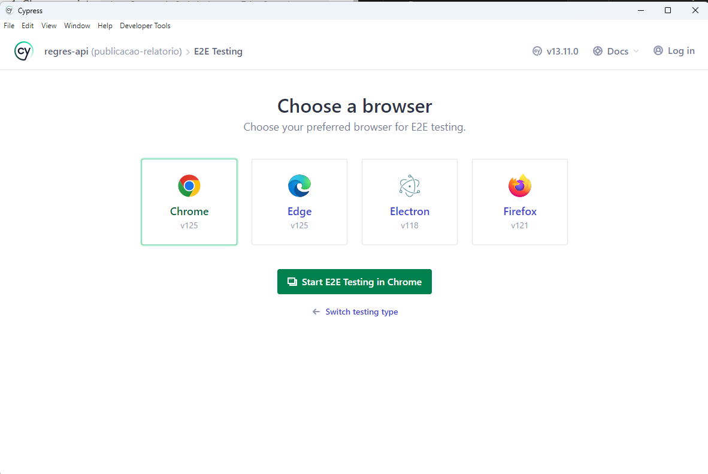
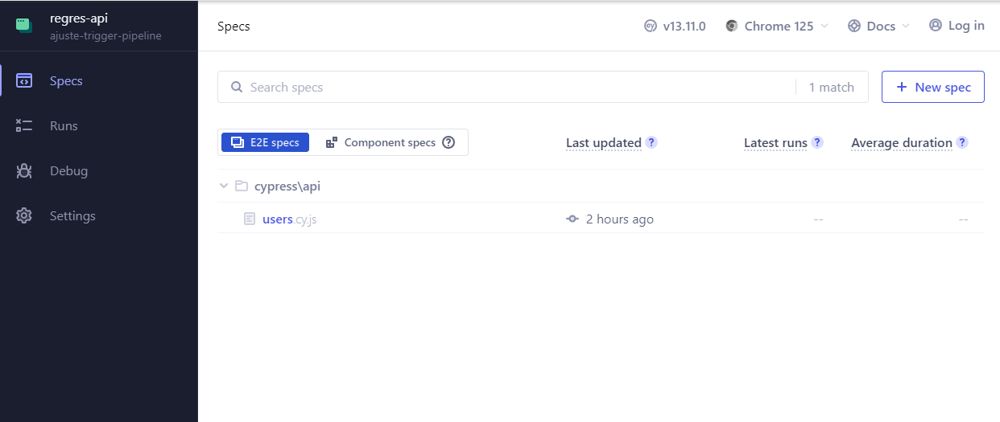
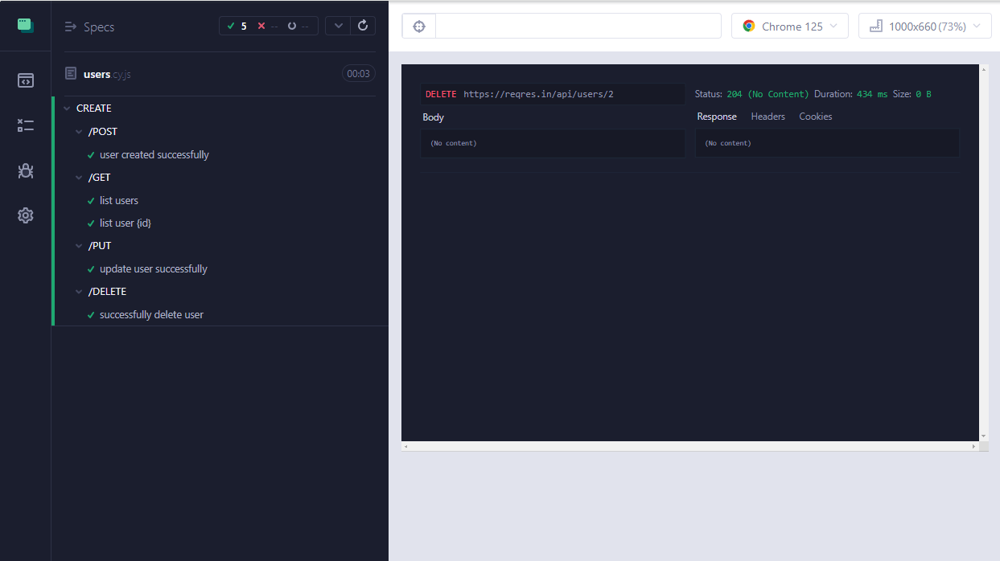
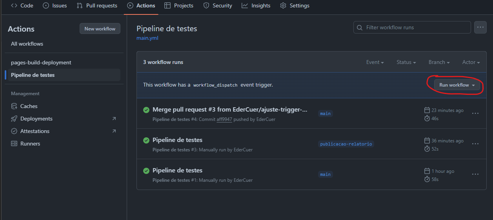
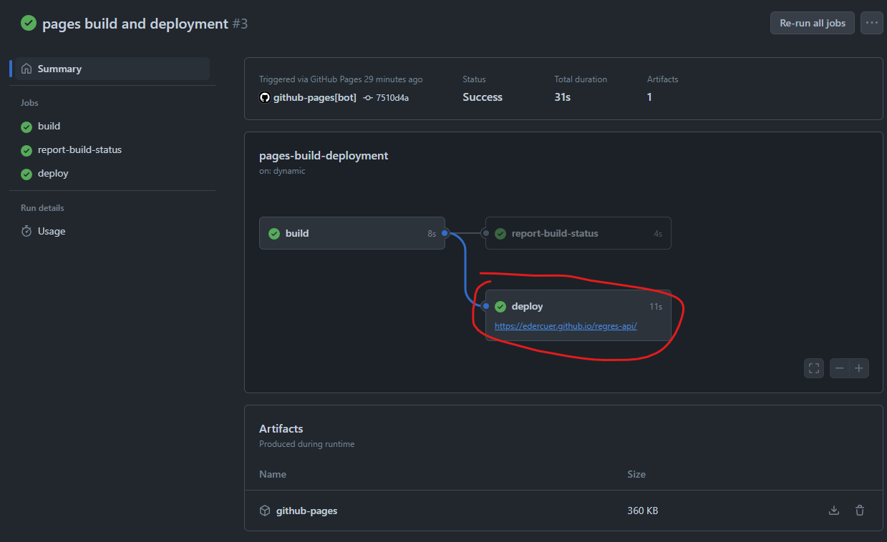
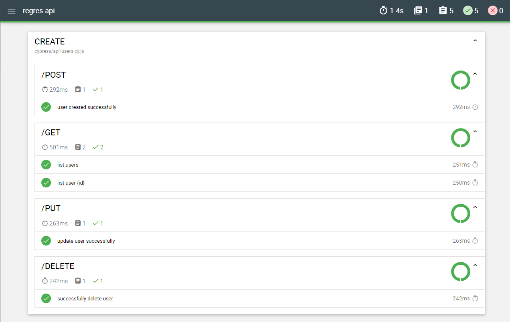

# Projeto de automação da API [Reqres](https://reqres.in/)

## Bibliotecas utilizadas e suas versões
[NPM](https://docs.npmjs.com/getting-started): 8.19.3\
[Node JS](https://nodejs.org/en): 19.1\
[Cypress](https://docs.cypress.io/guides/getting-started/installing-cypress): 13.11\
[Faker JS](https://fakerjs.dev/guide/): 8.4.1\
[Cypress Mochawesome Reporter](https://www.npmjs.com/package/cypress-mochawesome-reporter): 3.8.2\
[Cypress Plugin API](https://github.com/filiphric/cypress-plugin-api): 2.11.1\
[Chai JSON Schema](https://www.chaijs.com/plugins/chai-json-schema/): 1.5.1

## Configurando o projeto

1. Clone o projeto: `git clone git@github.com:EderCuer/regres-api.git`
2. Acesse o diretório do projeto e execute: `npm install`

## Executando os testes

### Headless mode
Para que os testes executem em background, sem abrir o navegador, execute: `npx cypress run`

### Headed mode
Caso a ideia seja visualizar os testes ocorrendo, execute: `npm run cy:open`

Após executar o comando, uma tela do Cypress abrirá para selecionarmos o browser que irá executar os testes. Selecione o browser da sua escolha e clique em "Start E2E Testing in {Browser}".

Em seguida o browser será iniciado, seleciona o arquivo "users.cy.js". Os testes serão executados.

## Explicando algumas bibliotecas utilizadas
[Faker JS](https://fakerjs.dev/guide/): gera massa para os testes, dessa forma não precisamos nos preocupar em qual nome escolher e também deixamos essa tarefa automática e dinâmica;

[Cypress Mochawesome Reporter](https://www.npmjs.com/package/cypress-mochawesome-reporter): utilizada para gerar o relatório dos testes;

[Cypress Plugin API](https://github.com/filiphric/cypress-plugin-api): facilita a visualização dos testes de API. Com ela conseguimos ver o response, headers, cookies e o body da requisição.

[Chai JSON Schema](https://www.chaijs.com/plugins/chai-json-schema/): para realizar a validação do json da response dos testes.

## Integração com a pipeline
Os testes foram integrados à pipeline. Dessa forma, é possível executá-los e visualizar seu relatório pelo Github Pages.

A ideia era deixar o mais parecido com aplicações reais.

Para executar a pipeline:
 1. Vá para "Actions";
 2. Selecione o Workflow "Pipeline de testes";
 3. Depois clique em "Run workflow".

Após a execução da pipeline o relatório será publicado automaticamente. Para visualizá-lo:
1. Vá para "Actions";
2. Selecione o Workflow "pages-build-deployment";
3. Selecione a última execução;
4. Clique no link do job "Deploy"

_______________________

# API Automation Project [Reqres](https://reqres.in/)

## Libraries used and their versions
[NPM](https://docs.npmjs.com/getting-started): 8.19.3  
[Node JS](https://nodejs.org/en): 19.1  
[Cypress](https://docs.cypress.io/guides/getting-started/installing-cypress): 13.11  
[Faker JS](https://fakerjs.dev/guide/): 8.4.1  
[Cypress Mochawesome Reporter](https://www.npmjs.com/package/cypress-mochawesome-reporter): 3.8.2  
[Cypress Plugin API](https://github.com/filiphric/cypress-plugin-api): 2.11.1  
[Chai JSON Schema](https://www.chaijs.com/plugins/chai-json-schema/): 1.5.1  

## Setting up the project

1. Clone the project: `git clone git@github.com:EderCuer/regres-api.git`
2. Access the project directory and run: `npm install`

## Running the tests

### Headless mode
To run the tests in the background, without opening the browser, execute: `npx cypress run`

### Headed mode
If you want to see the tests running, execute: `npm run cy:open`

After running the command, a Cypress window will open for you to select the browser that will run the tests. Select the browser of your choice and click on "Start E2E Testing in {Browser}".

Then the browser will start, select the file "users.cy.js". The tests will run.

## Explaining some libraries used
[Faker JS](https://fakerjs.dev/guide/): generates test data, so we don't have to worry about choosing names and we can make this task automatic and dynamic;

[Cypress Mochawesome Reporter](https://www.npmjs.com/package/cypress-mochawesome-reporter): used to generate the test report;

[Cypress Plugin API](https://github.com/filiphric/cypress-plugin-api): makes it easier to visualize API tests. With it, we can see the response, headers, cookies, and the request body.

[Chai JSON Schema](https://www.chaijs.com/plugins/chai-json-schema/): used to validate the JSON response of the tests.

## Integration with the pipeline
The tests were integrated into the pipeline. This way, it is possible to run them and view their report through GitHub Pages.

The idea was to make it as similar as possible to real applications.

To run the pipeline:
1. Go to "Actions";
2. Select the "Test Pipeline" Workflow;
3. Then click on "Run workflow".

After running the pipeline, the report will be published automatically. To view it:
1. Go to "Actions";
2. Select the "pages-build-deployment" Workflow;
3. Select the latest run;
4. Click on the job link "Deploy".

